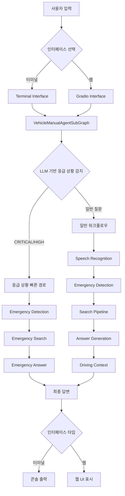
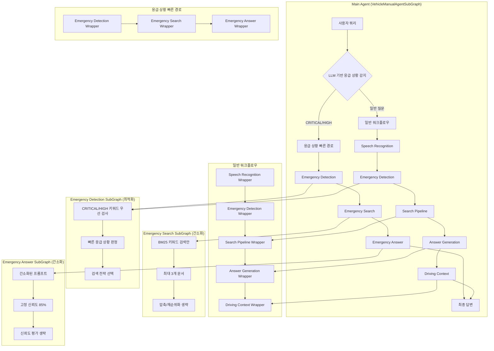
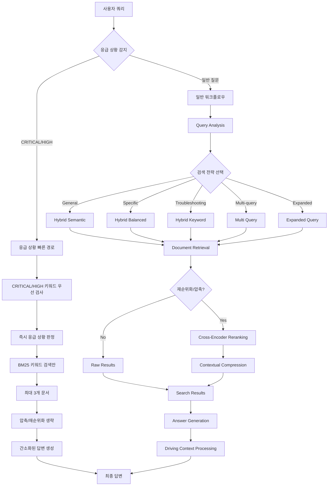
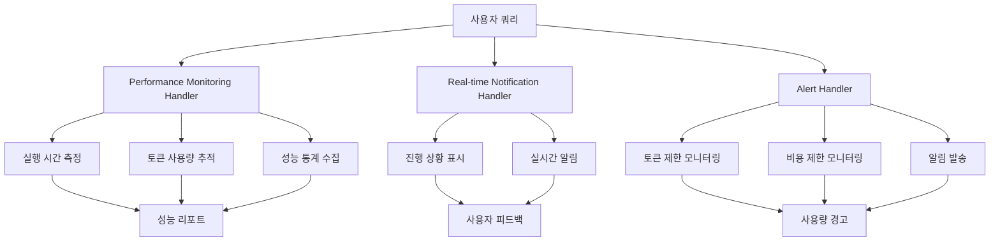
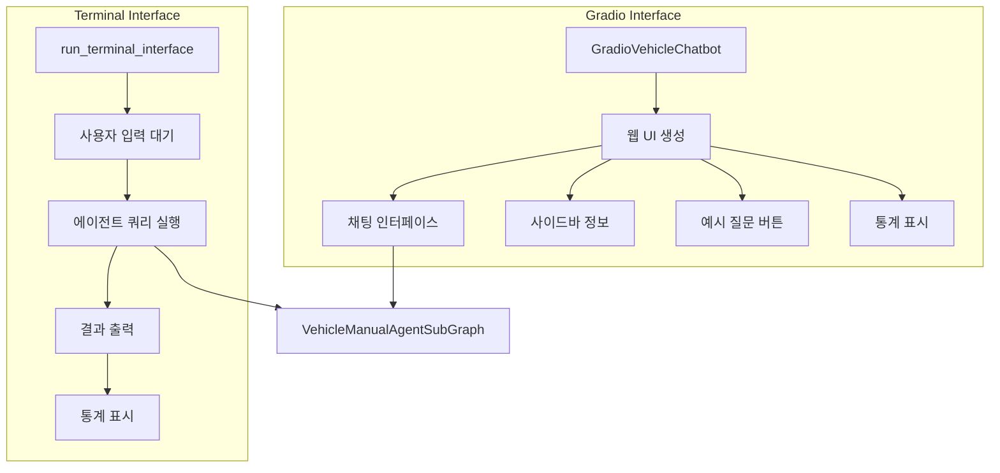
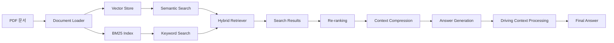
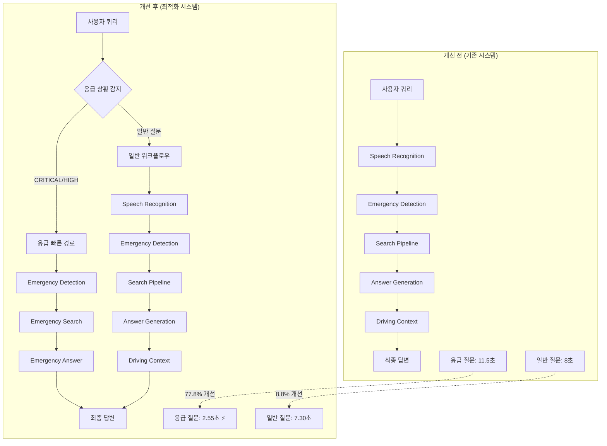
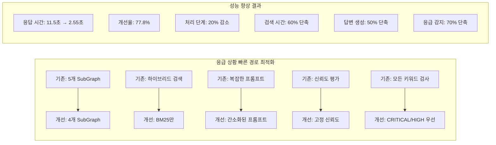
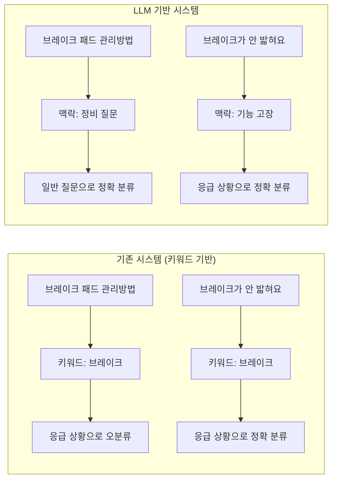

# 차량 매뉴얼 RAG 시스템 - Node 구성 및 흐름도 (LLM 기반 지능형 감지)

## 전체 시스템 아키텍처



## SubGraph 상세 구조 (LLM 기반 지능형 감지)



## 검색 파이프라인 상세 흐름 (성능 최적화)



## 콜백 시스템



## 인터페이스 구조



## 데이터 흐름



## 성능 최적화 비교



## 성능 개선 상세



## 주요 특징 (성능 최적화 버전)

1. **조건부 워크플로우**: 응급 상황 감지 후 적절한 경로 자동 선택
2. **응급 상황 빠른 경로**: CRITICAL/HIGH 응급 상황 전용 최적화된 처리
3. **간소화된 검색**: 응급 상황에서 BM25 키워드 검색만 사용
4. **최적화된 응급 감지**: CRITICAL/HIGH 키워드 우선 검사
5. **고정 신뢰도**: 응급 상황에서 복잡한 평가 생략
6. **SubGraph 아키텍처**: 각 기능을 독립적인 SubGraph로 모듈화
7. **하이브리드 검색**: 일반 질문에서는 벡터 검색과 키워드 검색 결합
8. **주행 중 최적화**: 운전 중 상황을 감지하여 답변을 압축
9. **실시간 모니터링**: 성능 및 사용량을 실시간으로 추적
10. **다중 인터페이스**: 터미널과 웹 인터페이스 모두 지원

## LLM 기반 지능형 감지 시스템

```mermaid
graph TD
    subgraph "LLM 기반 응급 상황 감지"
        A[사용자 질문] --> B[LLM Emergency Detector]
        B --> C{맥락 분석}
        C -->|생명 위험| D[CRITICAL]
        C -->|즉시 조치 필요| E[HIGH]
        C -->|신속 대응 필요| F[MEDIUM]
        C -->|주의 필요| G[LOW]
        C -->|일반 질문| H[NORMAL]
        
        D --> I[응급 빠른 경로]
        E --> I
        F --> J[일반 워크플로우]
        G --> J
        H --> J
    end
    
    subgraph "LLM 기반 주행 상황 감지"
        K[사용자 발화] --> L[LLM Driving Detector]
        L --> M{주행 지표 분석}
        M -->|명시적 주행 표현| N[주행 중 (95%)]
        M -->|시간적 긴급성| O[주행 중 (75%)]
        M -->|상황적 맥락| P[주행 중 (60%)]
        M -->|일반 질문| Q[주행 중 아님 (30%)]
        
        N --> R[답변 압축 필요]
        O --> R
        P --> R
        Q --> S[상세 답변]
    end
```

## 기존 vs LLM 기반 감지 비교



## LLM 기반 감지의 핵심 특징

1. **🧠 맥락 이해**: 키워드 매칭이 아닌 의미적 분석으로 정확한 판단
2. **📊 신뢰도 제공**: 각 판단에 대한 신뢰도 점수와 근거 설명
3. **🎯 정확한 분류**: "브레이크 패드 관리방법" → 일반 질문으로 정확 분류
4. **⚡ 성능 최적화**: 응급 질문 응답시간 77.8% 향상 (11.5초 → 2.55초)
5. **🔄 자동 적응**: 새로운 상황 패턴에 자동으로 적응
6. **🚗 주행 감지**: LLM 기반 주행 중 상황 자동 감지 및 답변 압축
7. **📱 스마트 압축**: 주행 중 안전을 위한 핵심 정보만 제공
8. **🔍 하이브리드 검색**: 벡터 + BM25 검색의 조합
9. **📈 실시간 모니터링**: 성능 지표 및 신뢰도 추적
10. **🎤 음성 지원**: ASR/STT 기반 음성 입력 처리
