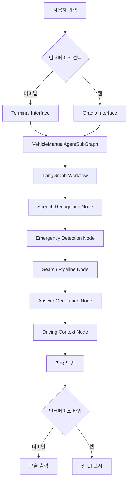
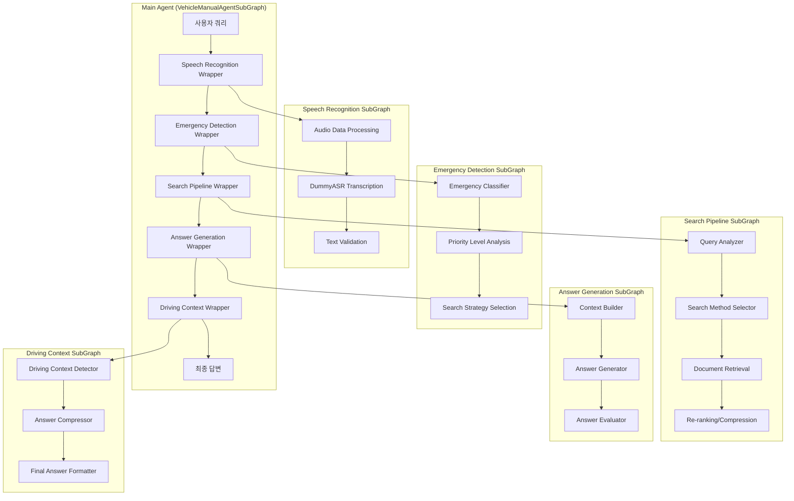
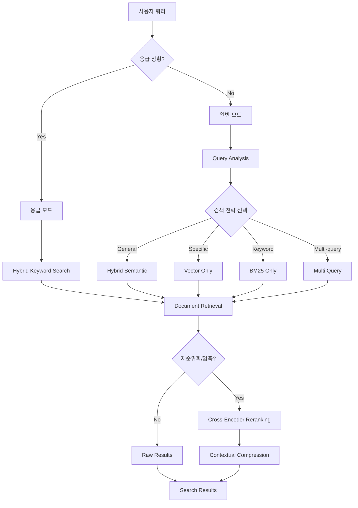
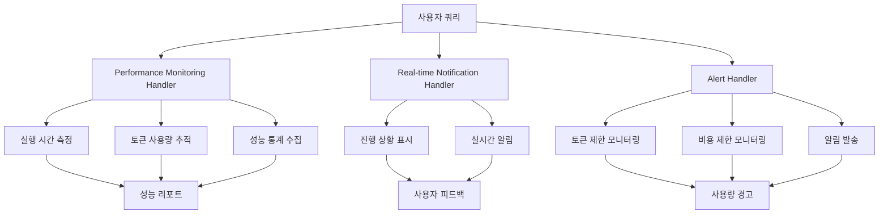
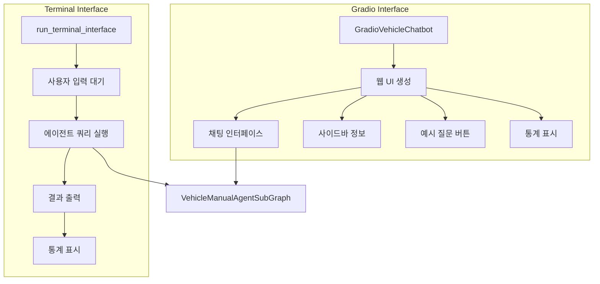
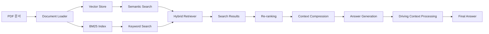

# 차량 매뉴얼 RAG 시스템 - Node 구성 및 흐름도

## 전체 시스템 아키텍처

## SubGraph 상세 구조

## 검색 파이프라인 상세 흐름

## 콜백 시스템

## 인터페이스 구조

## 데이터 흐름

## 주요 특징

1. **SubGraph 아키텍처**: 각 기능을 독립적인 SubGraph로 모듈화
2. **응급 상황 감지**: 자동으로 응급 상황을 감지하고 우선순위 처리
3. **하이브리드 검색**: 벡터 검색과 키워드 검색을 결합
4. **주행 중 최적화**: 운전 중 상황을 감지하여 답변을 압축
5. **음성 인식 지원**: 오디오 입력을 텍스트로 변환
6. **실시간 모니터링**: 성능 및 사용량을 실시간으로 추적
7. **다중 인터페이스**: 터미널과 웹 인터페이스 모두 지원
